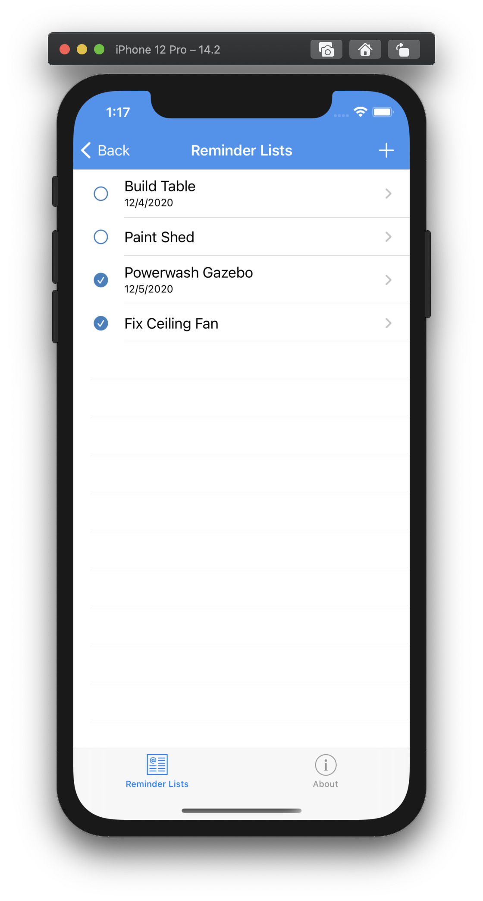

# XamarinAssessment

This is just a sample project set up to demonstrate and understanding of Xamarin crossplatform development and MVVM architecture.

## Some things to note:
 - Dependnecy injection is demonstrated in App.cs of the shared project. Change UseMockDataStore to false to write to SQLite db on the phone instead of the mock database.
 - Xunit project is there just as a demonstation of understanding the setup of unit tests/unit test project, there could be many more unit tests.
 
 ## Requirements:
  - Allow users to create and manage to-do lists
  - Add/edit/delete items from to-do lists
  - Mark to-do list items as completed
  - Store data locally
  - Data layer easily replaceable
  - Prompt the user to create list on load

## Screenshots: 

